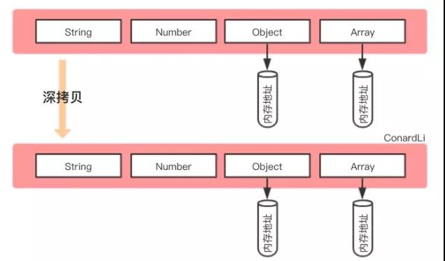
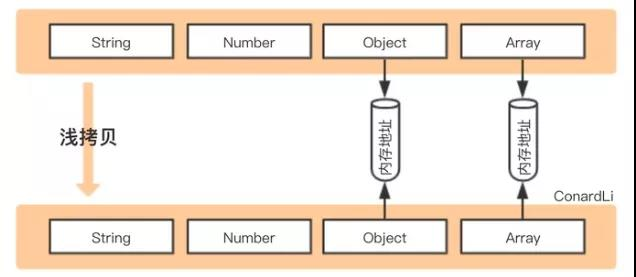

## 浅拷贝与深拷贝

``` bash
  浅拷贝：创建一个新对象，如果属性是基本类型则拷贝的是基本类型的值，如果是引用类型拷贝的是内存地址，如果其中一个对象改变了这个地址就会影响到另一对象
  深拷贝：将一个对象从内存中完整的拷贝一份，从堆内存中开辟一个新的区域存放新对象，修改新对象不会影响原对象
  # 
  # 

```


## 赋值、浅拷贝与深拷贝针对引用类型

``` bash
  赋值：赋值的是对象的地址，两个对象引用的是同一个地址，相互影响
  浅拷贝：重新在堆中创建内存，拷贝前后对象的基本数据类型互不影响，但是引用类型还是公用一块内存会相互影响
  深拷贝：在堆内存找那个开辟一个新的区域存放新对象，对对象的子对象进行递归拷贝，拷贝前后的两个对象互不影响
```

## 浅拷贝实现方式

``` bash
  1. Object.assign()
  2. 函数库lodash的_.clone方法
  3. 展开运算符...
  4. Array.prototype.concat()
```

## 深拷贝

``` bash
 1. JSON.parse(JSON.stringify()), 利用stringfy将对象转出json字符串，再利用parse把字符串解析成对象，一来一去新对象产生了而且对象会开辟新的栈实现深拷贝（不能处理正则 -> 空对象 和函数 -> null）
  2. 函数库lodash的_.cloneDeep方法
  3. jQuery.extend()方法   $.extend(deepCopy, target, object1, [objectN]) // 第一个参数为true,就是深拷贝
  4. 手写递归方法 原理：遍历对象、数组直到里边都是基本数据类型，然后再去复制
  
    function cloneDeep (obj, hash = new weakMap()) {
      if (obj === null) return obj // 如果是null或者undefined则不进行拷贝操作
      if (obj instanceof Date) return new Date(obj)
      if (obj instanceof RegExp) return new RegExp(obj) // 正则和时间对象
      if (typeof obj !== 'object') return obj // 可能是对象、普通的值，函数不需要拷贝
      if (hash.get(obj)) return hash.get(obj)
      let cloneObj = new obj.constructor() // 找到的是所属类原型上的constructor，而原型上的constructor指向的是当前类本身
      hash.set(obj, cloneObj)
      for(let key in obj) {
        if (obj.hasOwnProperty(key)) {
          cloneObj[key] = deepClone(obj[key], hash)
        }
      }
      return cloneObj
    }
    let obj = { name: 1, address: { x: 100 } }
    obj.o = obj // 对象存在循环引用的情况
    let d = deepClone(obj)
    obj.address.x = 200
    console.log(d)
```
