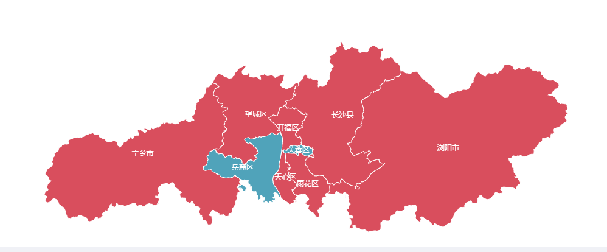
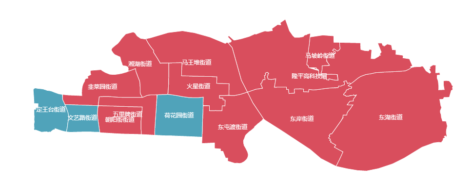

## 前言
``` bash
  根据echarts需要geojson格式的数据（包含名称及经纬度）
```
## 工具
``` bash
  下载<BIGEMAP地图下载器>工具导出kml文件
  在 http://geojson.io/ 网址中导入kml文件（只支持单个导入） 即右边能看到数据（可多个文件拼接），
  格式： 
  {
    "type":"FeatureCollection",
    "features":[
      {
        "type":"Feature",
        "geometry": {
          "type":"Polygon",
          "coordinates":[[[xx,xx]]]
        }
      }
    ],
    'properties': {
      'name': '芙蓉区',
      'cp':  [xx,x] // 若文字重叠则可使用该字段调整文字位置
    }
  }
  需注意在绘画乡镇街道层级时，街道分布可能零散出现多个geometry导致echarts报数据格式问题错误，这时需手动调整保证每条数据只有一个geometry
```
## 关于市级别
``` bash
  
```
## 关于乡镇街道
``` bash
  eg：
```