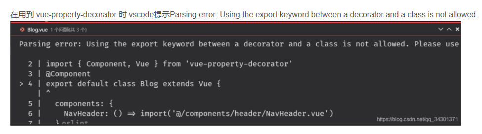

### Eslint文件结构
**用来指定JavaScript语言类型和风格**

`parserOptions：{
  sourceType: 'module' // js导入方式默认是script，此处指模块导入方式
}`
**指定环境的全局变量，以下配置指定浏览器环境**

`env：{
  browser：true，
  node：true，
  es6：true
}`

**配置标准的js风格**
`extends:[
]`

**提供插件，插件名省略eslint-plugin-，配置html规范**
`plugins:[
  "vue"
]`
**插件中的规则**
`rules:{
}`

### parserOptions
指定解析器选项


在.eslintrc.js中修改

`
parserOptions: {
  parser: 'babel-eslint', // 解析babel转成es5语法
    ecmaFeatures: { // 一个对象，指示您要使用哪些附加语言功能
      legacyDecorators: true // 处理脚手架修饰器的问题
    }
  }
}
`
### git按照eslint规范提交
**当项目开发人员多，代码规范不好把控时需要控制提交规范**

1.安装 npm install lint-staged -D

2.package.json配置
```
    script: {
        "lint-fix": "eslint --fix --ext .js --ext .ts --ext .vue packages/" // packages/为文件夹路径 --ext .js为文件类型
    }
    "lint-staged": {
        "*.{js,vue,ts}": "npm run lint-fix"
    }
```
2.1. vue-cli-serve脚手架方式
2.1.1 package.json添加以下配置（脚手架已经安装了yorkie,yorkie与husky不兼容）
```
    "gitHooks": {
        "pre-commit": "lint-staged"
    }
```
2.2. 采用的husky
2.2.1 安装 npm install husky -D
2.2.2 package.json添加以下配置
```{
   "husky": {
       "hooks": {
           "pre-commit": "npm run lint-fix", // 在commit之前先执行npm run lint-fix命令
       }
   }
```


