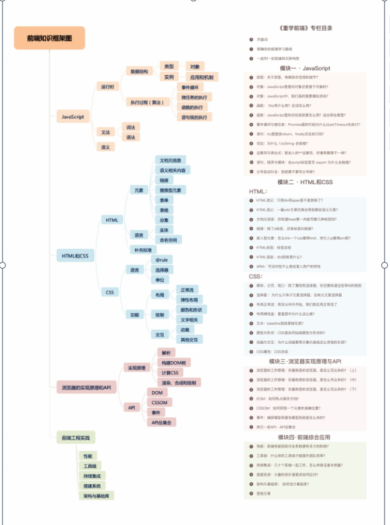

### 学习方法

> 对于计算机语言来说必定是：用规定的文法，去表达特定的语义，最终操作运行时的过程。

一、建立知识架构（逻辑性和完备性）`并列或递进关系`

1.文法（编译原理划分）
（1）词法
（2）语法
2.语法
3.运行时（程序 = 算法 + 数据结构）
（1）类型
（2）执行过程
二、根本溯源

### 知识架构

**js**

```
1. 运行时
    -数据结构
        --类型
            ---对象
            ---应用和机制
        --实例
    -执行过程
        --事件循环
        --微任务执行
        --函数执行
        --语句级的执行
```

```
2. 文法
 -语法
 -词法
```

```
3. 语义
```

**html和css**

```
html:
    -元素
        --文档元信息
        --语义相关内容
        --链接
        --替换型元素
        --表单
        --表格
        --总集
    -语言
        --实体
        --命名空间
    -补充标准
```

**浏览器的实现原理和api**

**前端工程实践**




