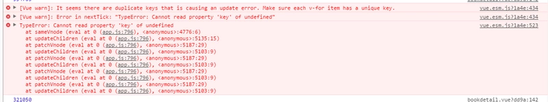

## 为什么使用vue.js

1. 体积小
2. 组件化开发：单页面，使用小型 独立和通常可复用的组件构成大型应用
3. 只关注视图层，数据驱动视图，双向数据绑定
4. 虚拟dom，频繁操作dom造成浏览器刷新卡顿
5. 容易上手，社区活跃

### vue源码分析

> 本质上是一个function实现的class，在他的原型及本身都扩展了一系列方法和属性。

#### 数据驱动

一个核心思想: 数据驱动。视图由数据驱动生成。

> 虚拟dom:用原生js对象去描述一个dom节点。

调用**this._init()**初始化。如果有el属性则调用**vm.$mount(vm.$options.el)**，将目标模板渲染成最终的DOM。
> 初始化做的事情：
> * 合并配置
> * 初始化生命周期
> * 初始化事件中心
> * 初始化渲染
> * 初始化data props computed watcher等。

在原型上的**$mount**方法实际上调用**mountComponent**方法，**mountComponent**核心是实例化**Watcher**，回调中调用了**updateComponent**，此方法调用**vm._render**生成**虚拟Node**最终调用**vm_.update**更新DOM.
**new Watcher**在这里有两个作用：
* 初始化执行回调函数。
* 当vm实例中检测的数据发生变化的时候执行回调函数。

### 组件化

另一个核心思想：组件化

> 把页面拆分多个组件，每个组件依赖的css，图片等放到一起开发维护，组件是资源独立的，每个组件在系统内是可复用的，组件之间可相互嵌套。

### 组件传值

一：父传子（props）

二：子传父

1.$emit（"事件名", 值（可多个））

2.$parent/$children $ref

三：兄弟传值

1.vuex

2.$emit和props组合

3.EventBus(创建一个EventBus.js文件，在需要的组件中引入/main.js文件引入，传值：event.$emit("事件名", 值)，接收：event.$on("事件名", (值)=>{}))

```js
// EventBus.js 暴露vue实例
import Vue from "Vue"
export default new Vue()
```

四：多层父子组件通信

1.vuex

2.provide/inject

```js
// 方法一：不能实时更新
// 祖/父组件
provide: {
    name: 'zs'
}
// 子组件
inject: ['name']

// 方法二：挂载太多多余的属性
// 祖/父组件
provide () {
    return {
        parentObj: this // 将整个实例挂载
    }
}
// 子组件 parentObj包含了传入的所有实例this的值
inject: ['parentObj']

```
### 数据双向绑定
>vue是一个mvvm框架，数据双向绑定对于ui控件而言，非ui控件不会涉及到数据双向绑定。vuex是单向数据流，**全局性数据流使用单项方便跟踪，局部数据流使用双向简易操作**

Object.defineProperty()函数可以定义对象属性相关描述符，其中get和set方法对于完成双向数据流起到了至关重要作用。
实现思路：
  简易版本：获取input输入框内容，Object.defineProperty()方法操作属性，get获取value，set设置值并改变innerhtml展示值
  vue版本：documentFragment（通过操作documentFragment文档片段操作dom而不会影响到真实到dom，操作完成之后可以添加到真实到dom上，这样到效率比直接在dom上修改要高很多）

## 引言


处理方案：
原因在于js本身值传递的特点导致，v-for最开始是每个item都有自己的key但是对象。数组是按引用传递的，内存地址不变 因为data数据改变但是key不变所以内存里就会有相同的key，可以采用JSON.stringfy（）或者先清空再赋值方法

### 加不加key区别

Vue默认使用就地更新策略，如果顺序被改变vue将不会移动dom元素匹配数据项，而是就地更新每个元素，并且确保它们在每个索引位置正确渲染。（默认模式是高效的，但只适用于不依赖子组件状态或临时DOM状态的列表渲染输出）

对于列表的增删如果给列表的每一项增加key即唯一索引，就可以清楚的知道两个列表之间的变化，不加key的话只能一个个对比然后进行操作。

### key的作用

更新组件时判断两个节点是否相同， 相同就复用否则就删除旧的创建新的,为了给 Vue 一个提示，以便它能跟踪每个节点的身份，从而重用和重新排序现有元素
因为带唯一key每次更新都不能找到可复用节点，要销毁和创建vnode，在dom中添加移除节点对性能的影响更大，而不带key只是对节点值进行修改 --- 》 对于只是简单的列表输出不带key的性能比带key好
对于大部分场景来说组件都有自己的状态。需添加key来更新组件状态
