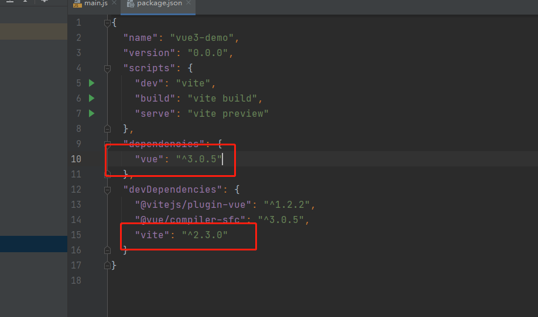
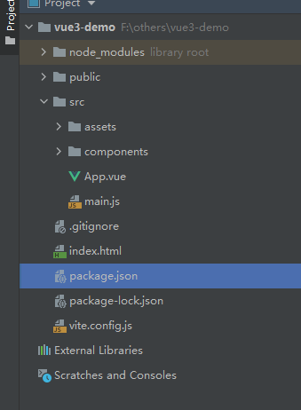

### 安装

    使用vue-cli安装最新稳定版：npm install vue@next；
    使用vite构建工具：npm init @vitejs/app <project-name>



### 开始使用



相比vue2.0 目录结构未发生变化

main.js(3.0版本明显精简很多，按需引入.)

vue2.0
.jpg)
vue3.0
.jpg)

>vue3.0

1.多节点

2.反应数据reactive data包含在反应状态reactive state变量中

    引入reactive，在reactive方法中声明，setup方法返回变量，template中获取返回对象中的键值对
3.methods 编写和反应数据一样需要在setup中返回

4.生命周期函数也需要和反应数据一样引入，在setup中使用

5.computed和反应数据一样，需要在reactive中使用 xxx：computed(() => xxx = xx)

6.props this不能直接拿到prop属性

```js
setup(props, context){ // 接收两个参数prop不可变组件参数，context vue暴露出来的参数（emit，slots，attrs）
    // 通过props参数获取属性
}
```
    
