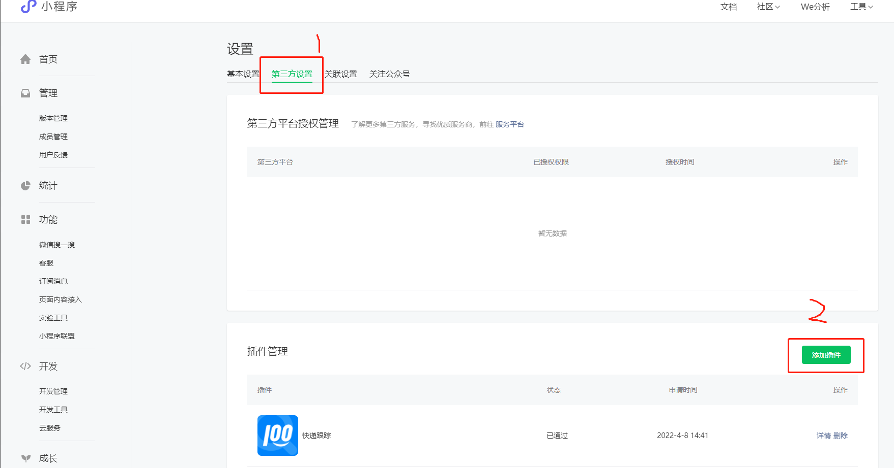
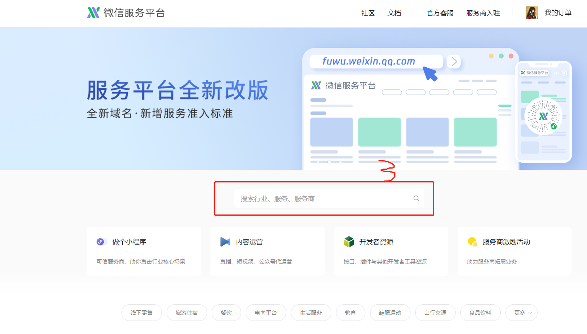

### 第三方授权操作

1.登录微信后台管理系统
2.设置 =》 第三方授权 =》 插件管理添加插件

3.app.json中添加插件配置
```js
// "provider": "wx6885acbedba59c14" // 插件appid
```
```json
{
  "plugins": {
    "kdPlugin": {
      "version": "1.1.2",
      "provider": "wx6885acbedba59c14" 
    }
  }
}
```
4. 组件中使用
```js
//使用 plugin:// 协议指明插件的引用名和自定义组件名
wx.navigateTo({
  url: "plugin://kdPlugin/index?num=xxx&appName=xxx",
})
```

### 富文本
> mp-html插件

### 二维码配置
1.下载校验文件之后放到相应域名文件下面
2.测试范围根据不同环境配置
3.测试链接用于测试调试用（配置的地址必须和数据对上才能调试，**调试时只能根据这个配置的测试地址调试否则会跳转到其他环境**）
