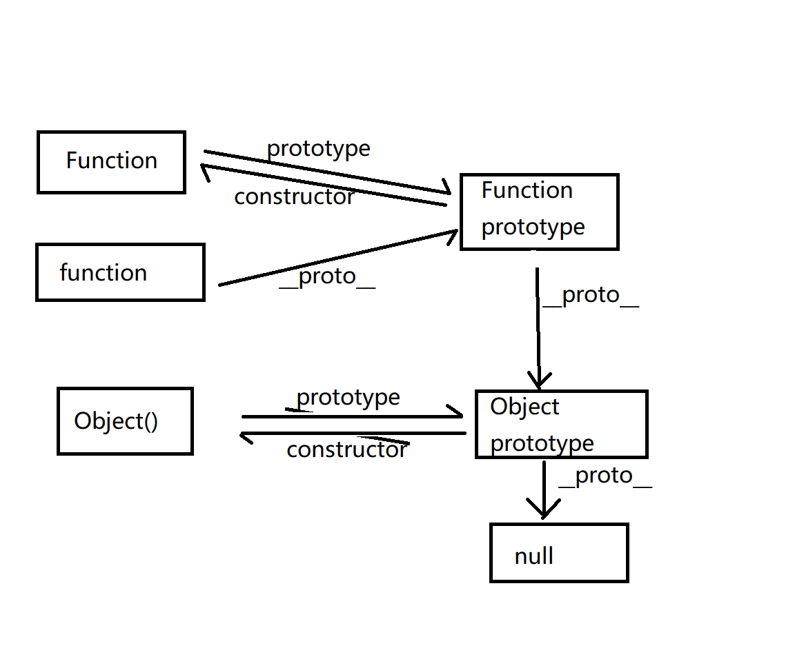

## 基础知识

### get和post
>参数长度当限制http协议没有规定过，是浏览器或者web服务器限制了url的长度
> post请求发送两次原因：第一次发送options请求，询问服务器是否支持修改头，如果支持则发送真正的请求。

### 模块化
>抽离公共代码，隔离作用域避免变量冲突。
> IIFE立即执行 => AMD(提前声明) => CMD(动态引入依赖文件) => CommonJS(nodejs自带的模块化) => UMD(兼容AMD) => webpack(代码分割) => ES Modules(支持import引入另一个js)

### http和浏览器

**http**：超文本协议，是互联网协议中应用最广泛的协议，是一个用于服务端和客户端发送请求和响应的标准，用于从www服务器传输文本到本地浏览器的传输协议。端口80。无状态
**https**：以安全为目标的http的通道，加入了ssl层，主要作用是建立安全通道来确保数组传输，保证网络传输的真实性。端口443
**tcp**三次握手，可靠性传输，面向链接，面向字节流，面向报文，首部最大字节20字节，只能1对1
**udp**无连接，不可靠传输，首部只有8字节，1对1 1对多
**websocket**：永久持久连接，基于http请求，在http中一个request只能对应一个response，而且这个response是被动的不能主动发起。

http请求方式：
head：类似get请求，只是没有返回具体的内容用户获取报头。
options：允许客户端查看服务器的性能比如服务器支持的请求方式等
BOM浏览器对象属性方法：
location，history，navigator。
cookie，localstorage，session：

> 都是存放到浏览器端，并且是同源。

cookie: 过期时间前有效；始终在同源的http请求中携带；可以在浏览器和服务端来回传递，容量小，大约4k左右。
session：关闭浏览器窗口失效；
localstorage：永久有效，需手动清除；
Document作用：位于最前面告诉浏览器以何种方式渲染，有严格模式（以浏览器的最高标准运行）和混杂模式（向后兼容）；

### 强制缓存和协商缓存
#### 强制缓存
> 向浏览器缓存查找结果，并根据该结果的缓存规则来决定是否采用该缓存结果的过程
#### 协商缓存
> 协商缓存是强制缓存失效后，浏览器携带缓存标识向服务器发起请求，由服务器根据缓存标识来决定是否使用缓存的过程

### 浏览器的重绘和回流
重绘：当前节点更改外观而不影响布局，重绘不一定引发回流。
回流：几何布局变化会导致，回流必定会发生重绘，成本高于重绘。

### npm安装机制
npm install命令 =》查询node_modules文件夹是否存在指定模块 =》
存在：不再安装
不存在：向registry查询模块压缩包网址，下载压缩包存放到根目录.npm文件下面，解压到当前到node_modules目录。
### package.json文件

> 是标准的json对象，对项目的描述文件。定义了项目所需模块及配置信息，npm install时根据该文件自动下载所需模块。

字段解释：

* script：运行脚本命令npm命令行缩写。
* dependencies：指定项目运行所依赖模块。
* devDependencies: 项目开发所需模块。
* peerDependencies: 主要用来供插件指定所需主工具的版本（比如需要使用elmentui框架就需要依赖vue，那么vue必须安装）。
* bin：指定内部各命令对应的执行文件的位置。
* main：指定加载的入口文件。
* config：添加命令行的环境变量。
* files：打包时包含的数组文件。

### new

原理：实现new命令执行步骤

* 创建一个空对象，作为将要返回的对象实例
* 将该对象的原型指向构造函数的prototype属性
* 将这个空对象赋值给函数的this关键字
* 开始执行构造函数内部代码
**如果return语句返回的是一个和this无关的新对象，new返回该对象。如果没有this关键字则返回空对象**
```js
function _new () {
    let args = [].slice.call(arguments) // 将arguments对象转换成数组
    let constructor = args.shift()
    // 创建空对象继承constructor的prototype属性
    let context = Object.create(constructor.prototype)
    let result = constructor.apply(context, args) // 执行构造函数
    return (typeof result === 'object' && result !== null) ? result : context // 如果返回结果是对象，就直接返回，否则返回 context对象
}
```

### 面向过程编程（pop）
> 分析出问题所需步骤，然后用函数把这些步骤一步一步实现，使用的时候一个一个依次调用
> eg：一趟公交车出发和到站，出发的时候是一个事件，到站也是一个事件，面向过程关注的是某一个事件而不是公交车对象。


### 面向对象编程（oop）
> 把事务分成一个个对象，然后由对象直接分工合作，以对象功能划分
> 特性：封装（对数据和行为的包装和信息的隐藏）、继承（上层是通用的，下层具有特殊性，子类自动共享父类的数据结构和方法）、多态（一个接口多种方式，不同的对象收到同一消息产生不同的结果）。
> 易维护、复用、扩展

#### 面向对象思维
> 抽取对象的共有属性和行为封装成一个类（模板）
> 对类进行实例化，获取类的对象

**ES6**
> es6中没有变量提升，必须先声明类再实例化对象
> 类里面的共有属性和方法必须加this
> 类里面的this指向：constructor里面的指向实例对象，方法里面的this指向调用者。
```ecmascript 6
 // 父类
class Father {
    constructor(name) {
        this.name = name
    }

    say() {
        return 'baba'
    }
}

// 子类
class Son extends Father {
    constructor(name, age) {
        super(name);
        this.age = age
    }
    say (){
        return super.say() + '， i am your son'
    }
}
```
**ES5**
创建对象的三种方式： new Object()，自定义构造函数，对象字面量。
构造函数：（存在浪费内存问题）
    静态成员：在构造函数本身上创建的成员，只能由构造函数本身访问
    实例成员：在构造函数内部创建的成员，只能由实例化的对象来访问
    扩展内置对象：Array.prototype.xx = function () {}
    继承：（通过call把父类型的this指向子类型）
```js
    function Person (name, age) {
        this.name = name
        this.age = age
    }
    function Student (name, age) {
        Person.call(this, name, age) // 此时的父类this指向子类this，并调用该函数
    }
    const stu = new Student('zs', 18)
    console.log(stu)
```

### 原型及原型链


### 作用域
> 定义变量的作用范围，决定了当前执行代码的变量的访问权限。

### 作用域链
> 当可执行代码内部访问变量时，先从本地作用域中查找，找到就立即返回结果否则就向父级查找...直到找到全局作用域，这种嵌套机制称为作用域链。

**应用场景**
1.单例模式
```ecmascript 6
function Single(){
    this.data = 'single'
}
Single.getInstance = (function () {
    var instance
    return function () {
        if (instance) return instance
        instance = new Single()
        return instance
    }
})()
let a = Single.getInstance()
let b = Single.getInstance()
// a === b // true
```
2.模拟私有化
3.柯里化(参数复用)

#### 闭包
内存泄漏解决方案：
    1.使用严格模式
    2.避免过度使用闭包
    3.在销毁阶段解绑相关事件


